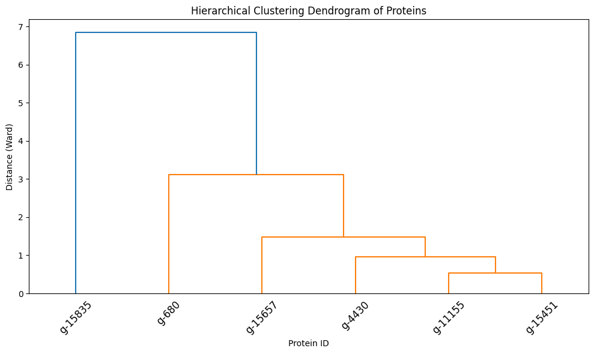
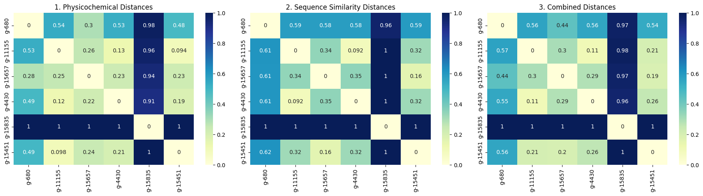

# Pipeline Examples
## Example 1: comparing cysteine cathepsin-like proteins in *Mnemiopsis leidyi*
The attached input file [Mnemiopsis_cysteine_subset.fasta](https://github.com/luquelab/team_superstars_BIL552/blob/main/docs/Mnemiopsis_cathepsin_subset.fasta) contains 6 amino acid sequences for cysteine cathepsin-like proteins identified in the *Mnemiopsis leidyi* (ctenophore) proteome. Each sequence is named with a unique g-ID tag (ie, g-1147). When you upload this sequence set to the pipeline, protein property analysis will be reported per protein. The attached output file [Mnemiopsis_example_output.pdf](https://github.com/luquelab/team_superstars_BIL552/blob/main/docs/Mnemiopsis_example_output.pdf) shows what successful reporting of these analyses should look like in CoLab for the entire pipeline.

Example dendrogram output:

Example heatmap output:

